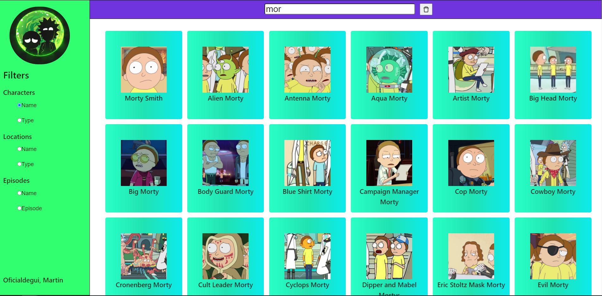

<h1>Rick and Morty Searcher</h1>
  
The Ricky and Morty's searcher counts with 3 different filters we can choose: characters, locations and episodes. After a successful search, we could click on any of the results in order to see specific information about the selected ítem.
  

 <h2>Follow this stepts in order to run the application</h2>
  
Requirements

<ol>
  <li>Node.js </li>
  <li>Git</li>
  <li>Yarn(Recommended)</li>
</ol> 
  
Starting

<ol>
  <li>yarn/npm start runs the app in the development mode.</li>
  <li>Open [http://localhost:3000](http://localhost:3000) to view it in the browser.</li>
</ol> 

This project was bootstrapped with [Create React App](https://github.com/facebook/create-react-app).

<h2>Images</h2>

